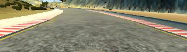
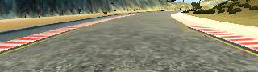
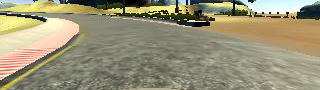
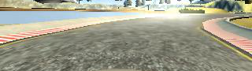

# **Behavioral Cloning**

### Summary

The final model was inspired by Nvidia's End to End Learning paper [1].

Two laps of regular center lane driving was collected initially. Left and right camera images were used to teach the car how to recover from being off center. Additional data driving the turns only was collected to teach the car to steer sharp turns. An effort was made to balance the dataset i.e. subsample straight driving samples (zero angle).

The model can be trained running the following command:

`python model.py --subsample=1 --model=nvidia --learn-rate=0.0001 --output-model=model`

In order to steer the car in the simulator you need to run:

`python drive.py models/model.h5`

### Model Architecture and Training Strategy

#### 1. Solution Design Approach

My idea was to start from the existing architecture and focus on data collection and augmentation tasks rather than experimenting with the network architecture. I started with a model build on top of a VGG network with the ImageNet weights. It's was a relatively large model and its training took a while.

I suspected that the VGG (with ImageNet weights) is not an optimal choice since there's little similarity between driving and ImageNet data. After some consideration I replaced it with the CommmaAi network [2].

CommaAi network is a small convolutional network. It was already used for a similar purpose. Additionally it was recommended by several people from Udacity forums as a good model to start with.

With the CommaAi model I got promising results for the first time. The car was able to stay on the road for considerate amount of time. It was still not reliable and had no recovery abilities. I added left and right camera images with modified angles to teach the car how to recover. After that the car was able to drive most of the track except for two sharp turns: sharp left and sharp right one.

I collected a relatively large amount of driving data for the both problematic turns but to no avail.

My hunch was that the dataset was too unbalanced. By looking at the histogram of driving data angles it was clear that the amount of zero angle samples (straight driving) overruns the other angles by a large amount. In order not to bias the model towards straight driving I subsampled the zero angles. However the issue with sharp turns persisted.

Finally I decided to try another architecture. I went with the model inspired by Nvidia End to End learning paper architecture [1]. This model was finally able to steer the car around the whole track including both problematic turns.

Lastly, I added dropout preceding fully connected layers to combat overfitting.

#### 2. Final Model Architecture

The final model architecture (model.py lines 165-196) was inspired by Nvidia End to End learning paper [1]. It's a convolutional neural network that was used by Nvidia's researchers to steer an actual autonomous car.

It's consists of overall 5 convolutional layers. The first three layers are using 5x5 filters. They have 24, 36, and 48 filters respectively with a stride of 2. The last two convolutional layers use 3x3 filters. They both have 64 filters with a stride of 1. All of convolutional layers are using ELU activation function. Convolutional layers are followed by 3 fully connected layers using ELU as activation function. Each FC layer is preceded by a dropout layer. The output layer uses linear activation. The loss function is mean squared error.

#### 3. Creation of the Training Set & Training Process

To capture good driving behavior, I first recorded two laps on track one using center lane driving.

Center camera images were taken with non essential parts removed to ensure that the model is learning the right features. That resulted in cropping 50 pixels from the top to remove the sky and 20 pixels from the bottom to remove the front part of the car. Here is an example of a cropped image from the center camera:

To teach the model how to recover from being off center I took left and right camera images and adjusted the angle accordingly.

To augment the data, I also flipped center camera's images and angles thinking that this would help the model to generalize.

The model was still unable to steer both left and right sharp turns and for that reason I recorded additional data driving only these two curves. Here are example images of both problematic turns:

After the collection process, I had around 60k data points.

I used train_test_split function to randomly shuffle the data set and put 20% of the data into a validation set.

I trained the model for 10 epochs with early stopping enabled. I've chosen the number of epochs empirically. The validation error usually stopped decreasing after 10 epochs. I used an Adam optimizer with the learning rate of 0.0001.

### Notes

- [1] [End to End Learning for Self-Driving Cars](https://arxiv.org/abs/1604.07316)
- [2] [CommaAi Research](https://github.com/commaai/research)
