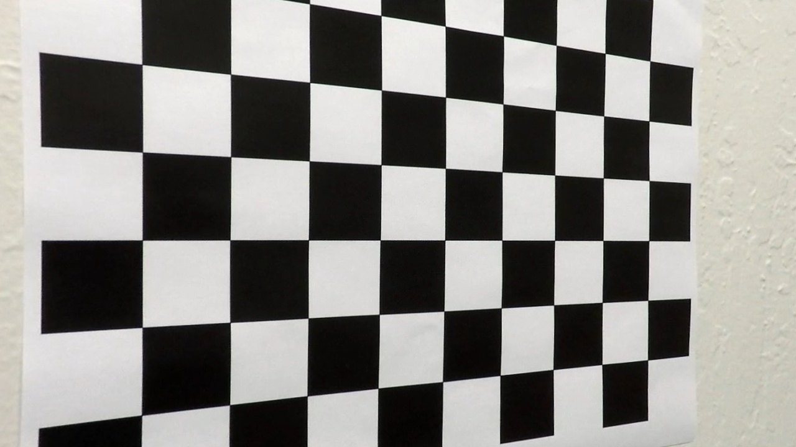
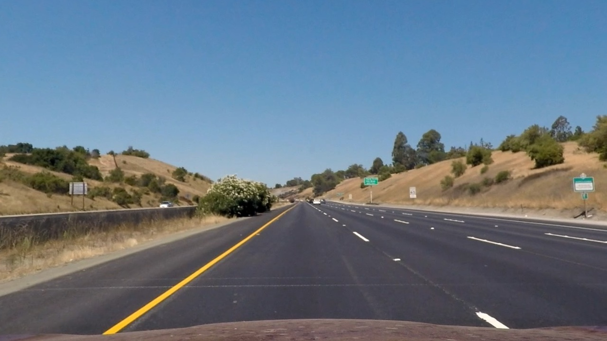
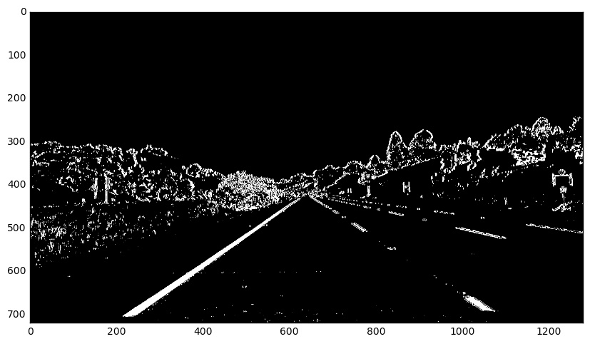
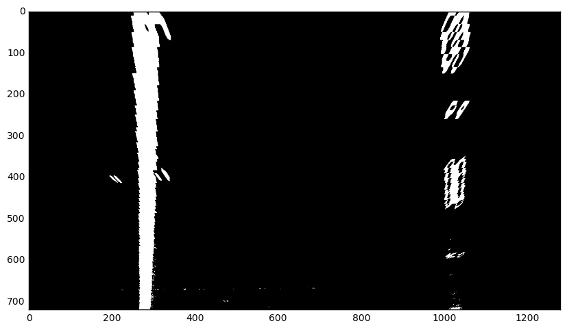
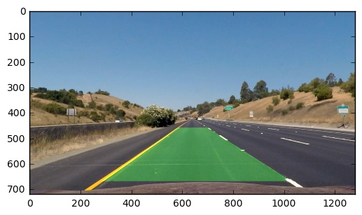

# Advanced Lane Finding Project

### Camera Calibration

The code for this step is contained in lines 11 through 37 of the file called `camera_cal.py`.

I start by preparing "object points", which will be the (x, y, z) coordinates of the chessboard corners in the world. Here I am assuming the chessboard is fixed on the (x, y) plane at z=0, such that the object points are the same for each calibration image. Thus, `objp` is just a replicated array of coordinates, and `objpoints` will be appended with a copy of it every time I successfully detect all chessboard corners in a test image. `imgpoints` will be appended with the (x, y) pixel position of each of the corners in the image plane with each successful chessboard detection.

I then used the output `objpoints` and `imgpoints` to compute the camera calibration and distortion coefficients using the `cv2.calibrateCamera()` function.  I applied this distortion correction to the test image using the `cv2.undistort()` function and obtained this result:

Original image:


Undistorted:



### Pipeline (single images)

To identify a lane I perform the following steps:
1. undistort the input image using camera calibration data
2. threshold and binarize the image
3. apply perspective transform
4. identify left and right lane line
5. calculate the curvature of the lane
6. mark the lane area

Test images were processed by running:
`python images.py`

#### 1. Undistort the input image using camera calibration data

As a first step we undistort the image using `cv2.undistort()` function and the calibration data that we obtained previously (described in Camera Calibration section).

Undistortion applied to a test image:



#### 2. Threshold and binarize the image

I used a combination of color and gradient thresholds to generate a binary image (thresholding steps at lines 14 through 38 in `pipeline.py`).  Here's an example of my output for this step.



#### 3. Perspective transform

The code for my perspective transform includes a function called `warp()`, which appears in lines 41 through 66 in the file `pipeline.py`. The `warp()` function takes an image as an input. The source and destination points are defined in the function itself.

```
points = np.array(
    [(581, 460),
     (278, img_size[1] - 50),
     (1020, img_size[1] - 50),
     (700, 460)])
src = np.float32([points])

dst = np.float32(
    [[278, 0],
     [278, img_size[1]],
     [1020, img_size[1]],
     [1020, 0]])
```

This resulted in the following source and destination points:

| Source        | Destination   |
|:-------------:|:-------------:|
| 581, 460      | 278, 0        |
| 278, 670      | 278, 720      |
| 1020, 670     | 1020, 720      |
| 700, 460      | 1020, 0        |

I verified that my perspective transform was working as expected by drawing the `src` and `dst` points onto a test image and its warped counterpart to verify that the lines appear parallel in the warped image. Here's an example of a warped test image.



#### 4. Identify left and right lane line

I used the sliding window approach as described in `Finding the Lines` section. I implemented this step in lines 69 through 138 in my code in `pipeline.py` in the function `find_lane_slow` (a faster version without computing histogram in lines 141 through 167 in function `find_lane_fast`).

First I computed a column wise histogram to find a point (x coordinate) for where to start search for the line (it's at the histogram's peak value). I used this point to center the sliding window.

I applied the sliding window from the bottom to the top of an image in few iteration (each taking portion of an image). In each iteration I identified "hot" pixels (the ones inside the window) that most likely represent the lane. Before every new iteration the window is re-centered according to the pixel distribution.

In the end I fit the lane lines with a 2nd order polynomial using numpy's `polyfit` function.

#### 5. Calculate the curvature and offset from the center

The curvature was calculated using the following equation:

`R_curve = (1 + (2Ay + B)**2)**(3/2) / |2A|`

The code is contained in the `compute_curvature` function (lines from 193 to 213) in the `pipeline.py`.

#### 6. Mark the lane area

I implemented this step in lines 170 through 190 in my code in `pipeline.py` in the function `draw_lane()`. I apply the reverse perspective transform to the points that identify a lane. Here is an example of my result on a test image:



### Pipeline (video)

The video was obtained by running:

`python video.py --input udacity/project_video.mp4 --output processed.mp4 --smooth=ma`

Here's a [link to my video result](https://youtu.be/rTAJ8oTjSGk)

### Discussion

The lane line finding pipeline fails when lane lines have little contrast compared to the rest of the image. That usually happens due to bad lightning conditions e.g. shadows or strong sunlight.

There might be different ways how to approach that. Contrast enhancing via histogram equalization comes to mind. On the other hand image thresholding part could be improved. I only used color and gradient based thresholding. Other thresholding approaches could be implemented like magnitude and direction of gradient.

Another idea from the top of my head is to implement a multi stage thresholding where the thresholding parameters are chosen on basis how many pixels the previous stage has returned.
