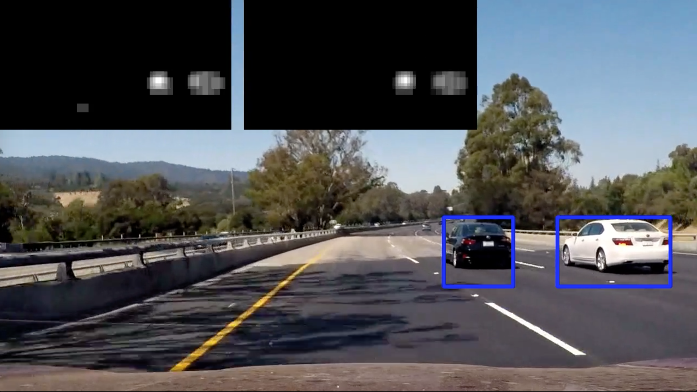

# Vehicle detection and tracking

The goal of the project was to create a robust pipeline (algorithm) to detect and track vehicles in a video.

The solution consist of two parts: 
 - a trained ML model to detect the presence of a vehicle in an image patch
 - a pipeline that reliably identify a vehicle in a video frame and is robust to noise

A more detailed description of the pipeline is available in [the writeup](writeup.md).

## Steps to reproduce the results

### Training the vehicle detector

`python detector.py`

This will train a ML model used to detect a vehicle in a image patch. 

Note that the training dataset is not included due to its size but the instruction how to obtain it is available in [the original repository](https://github.com/udacity/CarND-Vehicle-Detection). The code expect to have images of vehicles in `data/vehicles` and images of non-vehicle in `data/non-vehicles` directories.

A pre-trained model is available in the repository and can be used instead of training your own. 

### Testing the pipeline on test images

The test images are included in `test_images` directory. They can be reproduced by running

`python images.py`

### Video output

The main output of the project is the video (available [here](https://youtu.be/BzXyn6KZZmo)). It can be reproduced by running

`python video.py --input udacity/project_video.mp4 --output processed.mp4`

