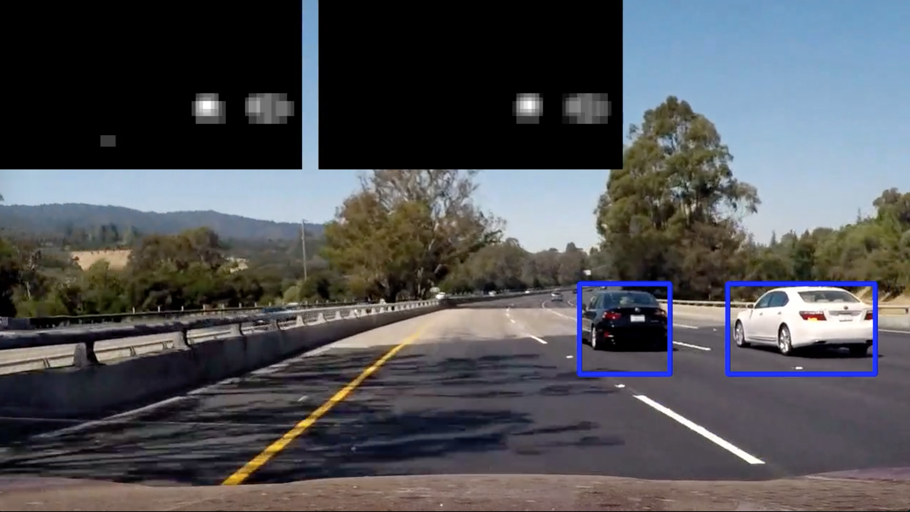

# **Vehicle Detection Project**

### Training a Vehicle Detector with Histogram of Oriented Gradients (HOG)

The code for the training procedure is contained in lines 45 through 108 of the file called `detector.py`.

To train the detector we were provided with two different datasets of vehicle images (GTI, KITTI) and another two containing non-vehicle images (GTI, Extras). The GTI dataset was obtained from a video stream and its images were quite similar one to another. That made constructing a training and testing dataset more challenging. A random split was not sufficient anymore to get a valid indication of the detector's accuracy. Images in KITTI's dataset were less similar to each other and that made them more suitable for the testing dataset.

I end up using GTI vehicle images for training dataset plus a large portion of KITTI's images. The last portion of KITTI's images I kept for the testing dataset. Similarly for the non-vehicle images: GTI for training, last part of Extras for testing.

I then explored different color spaces and different `skimage.hog()` parameters (`orientations`, `pixels_per_cell`, and `cells_per_block`).  I grabbed two images from each of the two classes and displayed them to get a feel for what the `skimage.hog()` output looks like.

Here is an example using the `LUV` color space and HOG parameters of `orientations=18`, `pixels_per_cell=(8, 8)` and `cells_per_block=(2, 2)`:

I trained a linear SVM using sklearn library. The final HOG parameters were chosen empirically by trying out different values starting from the values provided in code in lessons.

One would normally do a grid search with cross validation over a space of plausible parameters (HOG and SVM hyper parameters). However, the obtained parameters were good enough to get over 99% accuracy so there was no need in adjusting the parameters.

You can train the vehicle detector by running:
`python detector.py`

The training code expects to find the training images in `data/vehicles` for vehicles and in `data/non-vehicles` for no vehicles. The training data is not included due to its size.

### Sliding Window Search

The code for this step is contained in lines 149 through 214 of the file called `detector.py`. A search window of 64x64px is slided over a search area (where we would expect a lane to be). On each iteration we move the window 2 cells ahead (16px) and extract hog features.

Ultimately I searched on two scales using LUV 3-channel HOG features plus spatially binned color and histograms of color in the feature vector. Here is an example image:

### Video Implementation

Here's a [link to my video result](https://youtu.be/BzXyn6KZZmo).

I recorded the positions of positive detections in each frame of the video.  From the positive detections I created a heatmap and then thresholded that map to identify vehicle positions. To make the pipeline more robust and remove false positives I added another step. I integrated heatmaps of 12 frames and require at least 7 detections to acknowledge it as a valid detection.

I then used `scipy.ndimage.measurements.label()` to identify individual blobs in the heatmap. I assumed each blob corresponded to a vehicle. I constructed bounding boxes to cover the area of each blob detected.

Here's an example result showing two heatmaps from a video frame (the one from the current frame and an integrated one) together with the bounding box overlaid on the vehicle.

You can run the video processor by running:
`python video.py`

By default the code expects to find the project video in `udacity` directory which is not included due to its size.

### Discussion

One of the issues with the pipeline is that if two cars are close together it marks them as one. Image segmentation with watershed method could be be applied to overcome this issue.

The vehicle detection is still prone to false detections even though it achieves near perfect accuracy on the testing dataset. The testing data set was selected carefully: only taking the bottom portion of the KITTI dataset. My hunch is that the characteristics of training and testing images differ from the ones extracted from the project video. Using additional dataset provided by Udacity would likely improve the real world performance.
